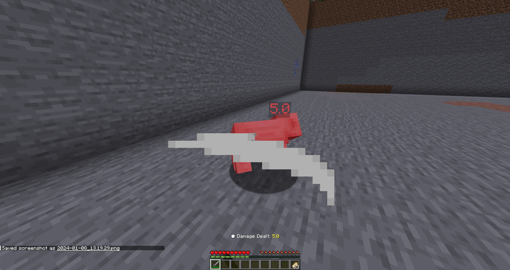

# Damage Display

A Minecraft Spigot plugin that offers the possibility to keep track of damage dealt and received.

# Features

 - Show a [TextDisplay](https://hub.spigotmc.org/javadocs/spigot/org/bukkit/entity/TextDisplay.html) whenever an entity takes damage
 - Send out ActionBar messages to players in regard to damage that has been taken.
 - Display an ActionBar message whenever a player has dealt an amount of damage to an entity.

# Installation
1. Download the latest version of the DamageDisplay plugin
2. Place the downloaded `.jar` file inside of your server's plugins directory
3. Restart your server

# Usage
Whenever a player is going to take or deal an amount of damage, an ActionBar message is automatically going to be
shown to the player in question. There is also another case when an entity takes an amount of damage, that damage will
be displayed to anyone looking as a TextDisplay floating near the position that the damage has been taken at.

# Permissions

### damagedisplay.enabled  **( !! WIP !! )**
- Description: Enables the ActionBar messages for the player 
- Default: True

### damagedisplay.command.info  **( !! WIP !! )**
- Description: Enables the ActionBar messages for the player
- Default: True

### damagedisplay.command.toggle  **( !! WIP !! )**
- Description: Enables the ActionBar messages for the player
- Default: True

# Support & Contribution
In regard to possible bugs that might show up, please open an issue on the [Github Repository](https://github.com/JustKato/DamageDisplay).
Contributions are more than welcome! Fork the repository, make your changes and submit a pull request.

# License
This project is licensed under the [MIT License](./LICENSE)